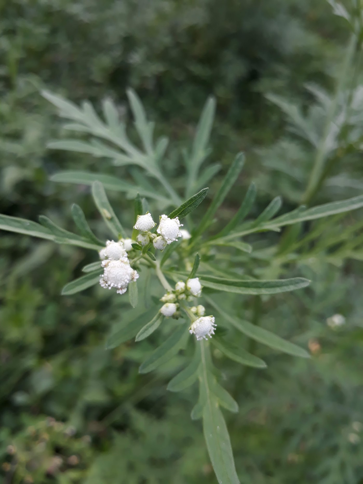

# Computational ecology

The increasing availability of large ecological and environmental
datasets requires advanced computational and statistical approaches for
data integration, analysis, and interpretation. My research applies
computational ecology methods, including ecological modeling, machine
learning, and bioinformatics, to understand community dynamics,
ecosystem processes, and complex ecological interactions.

- Ecological data analysis and visualization (developing R and Python
  packages)

- Statistical modeling of ecological communities

- Meta-analysis and synthesis of ecological datasets

- Environmental metagenomics and data analysis

# Ecosystem restoration ecology

## Ecological restoration of forests and grasslands invaded by invasive plant species

My research investigates how alien invasive plant species alter native
vegetation, soil properties, and microbial communities in forest and
grassland ecosystems. I am interested in understanding ecological
recovery processes and evaluating restoration strategies that promote
native biodiversity and ecosystem functioning following biological
invasions. *Parthenium hysterophorus*

## Ecological restoration of abandoned agriculture lands

 *Landscape of Dolakha district, central
Nepal*

Widespread abandonment of mid-hill farmland, driven by large-scale
labour out-migration, is opening space to revive Nepal’s lost
subtropical and temperate forests; my research therefore uses paired
vegetation and soil surveys to quantify how site conditions on these
fallow fields converge with, and can be steered toward, the composition
and function of the nearest remnant forest stands.

## Ecological restoration of rubber monoculture plantations

 *Rubber monoculture plantation in
steep slope*

As falling rubber prices and yield decline drive widespread abandonment
of tropical monoculture plantations, my research tracks
microbial-community dynamics across chronosequences of these sites to
compare how natural regeneration versus active restoration plantings
steer soil biota toward rainforest reference states.
