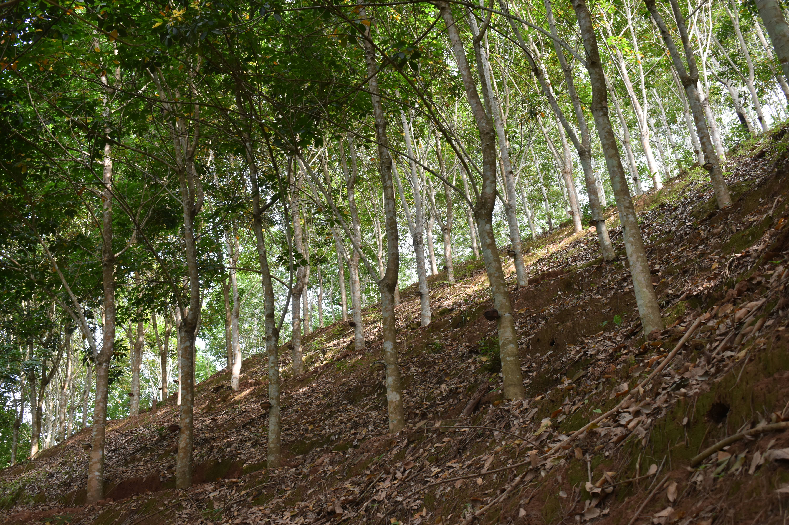

# Microbial Ecology & Environmental Metagenomics

Metagenomics has emerged as a powerful approach for deciphering
belowground microbial communities. My research applies metagenomic tools
and computational analyses to understand microbial ecology during
ecosystem restoration and to reveal microbial community responses to
environmental disturbances and ecological change.

Research areas include:

- Soil microbial ecology

- Environmental metagenomics

- Microbiome data analysis

- Bioinformatics and computational methods

- Microbial community dynamics

# Ecosystem restoration ecology

## Ecological restoration of abandoned agriculture lands

 *Landscape of Dolakha district, central
Nepal*

Widespread abandonment of mid-hill farmland, driven by large-scale
labour out-migration, is opening space to revive Nepal’s lost
subtropical and temperate forests; my research therefore uses paired
vegetation and soil surveys to quantify how site conditions on these
fallow fields converge with, and can be steered toward, the composition
and function of the nearest remnant forest stands.

## Ecological restoration of rubber monoculture plantations

 *Rubber monoculture plantation in
steep slope*

As falling rubber prices and yield decline drive widespread abandonment
of tropical monoculture plantations, my research tracks
microbial-community dynamics across chronosequences of these sites to
compare how natural regeneration versus active restoration plantings
steer soil biota toward rainforest reference states.
