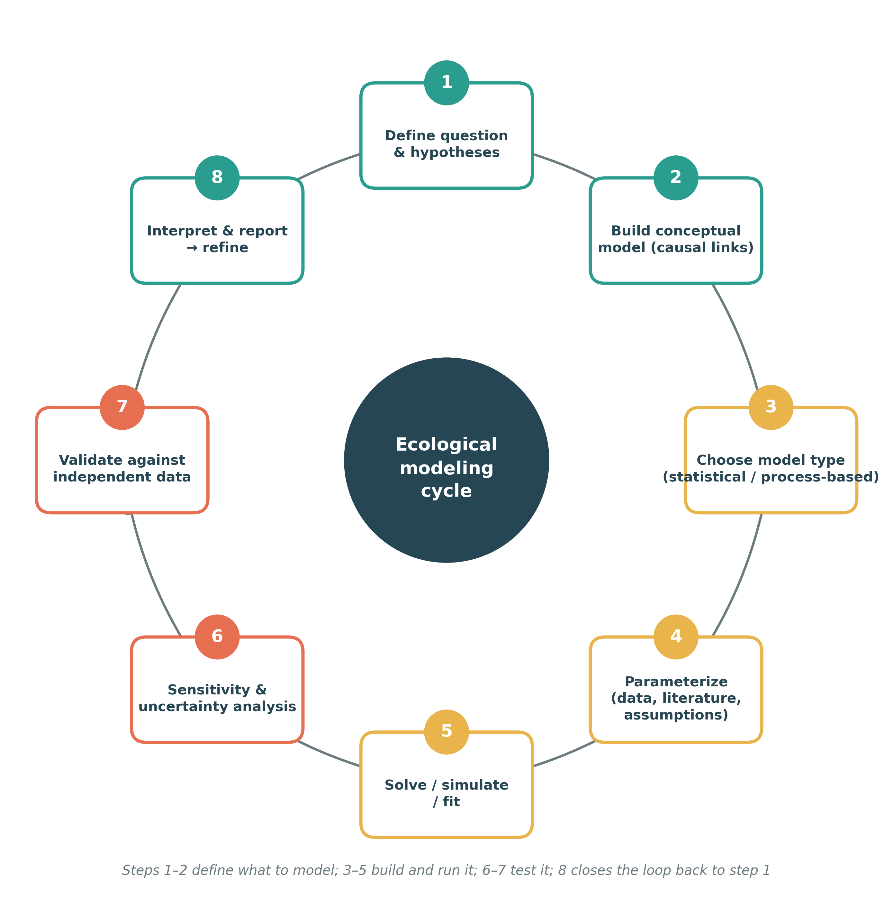

# Ecological modeling

Ecological modeling provides a quantitative framework for understanding
how organisms, communities, and ecosystems respond to environmental
conditions and ecological processes.

{fig-align="center"
width="516"}

## Example 1: Species distribution model

Species distribution modeling (SDM) is a quantitative approach for understanding and predicting where species may occur based on their relationship with environmental conditions. It is widely used in ecology, biogeography, biodiversity conservation, climate-change research, and the study of invasive species.

## Example 2: Community assembly processes

Community assembly models can be used to investigate how environmental filtering,
competition, dispersal, and stochastic processes determine species composition
along environmental gradients.

Common approaches include:

- Trait-based models
- Joint species distribution models
- Generalized dissimilarity models
- Null models
- Structural equation models
- Multivariate ordination and constrained ordination
- Spatial models

These approaches allow ecological observations to be linked to hypotheses about
the mechanisms driving community composition.

## Example 3: Dynamics of biotic resistance mechanism

<a href="https://onlinelibrary.wiley.com/doi/10.1002/brv.70190"
   target="_blank"
   class="meta-link">
  Read paper Sheppard et al. 2026 on Wiley →
</a>